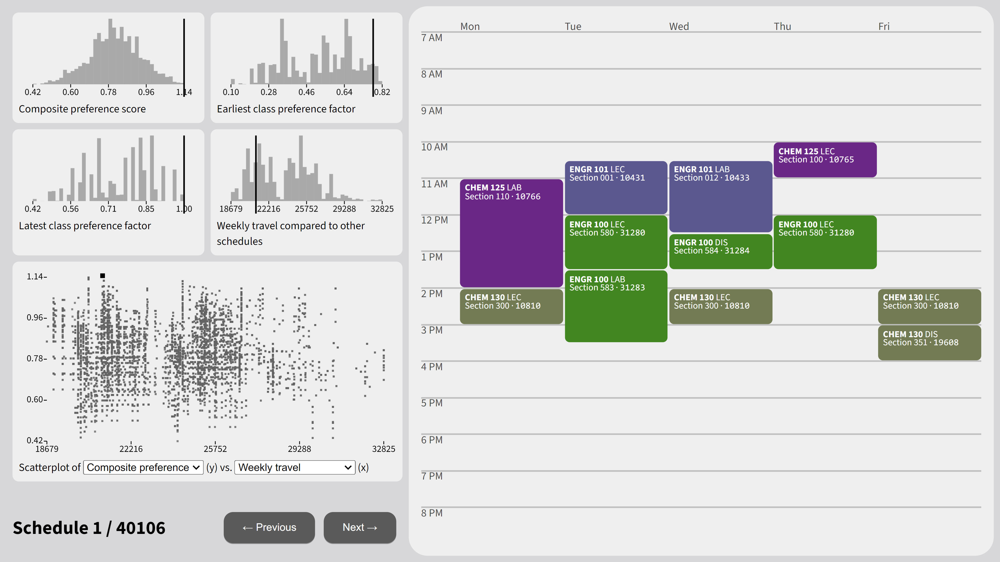

# SchedOpt.org

Supercharge your university schedule. Specify your courses and preferences, and SchedOpt.org will find your best schedules. No more manual fiddling!

Coming to the University of Michigan (Ann Arbor) in summer 2022

_Powered by AWS API Gateway, AWS Lambda, and AWS DynamoDB_
